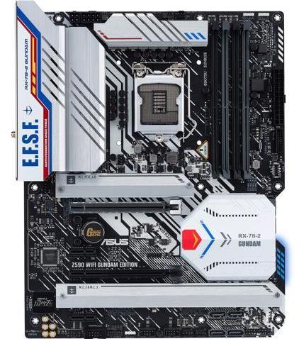
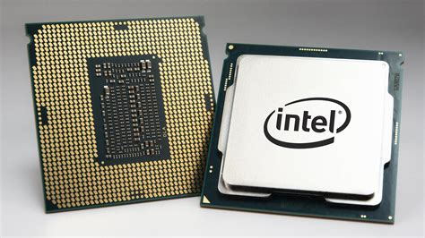
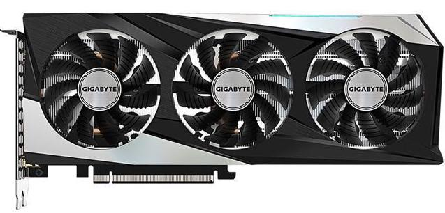
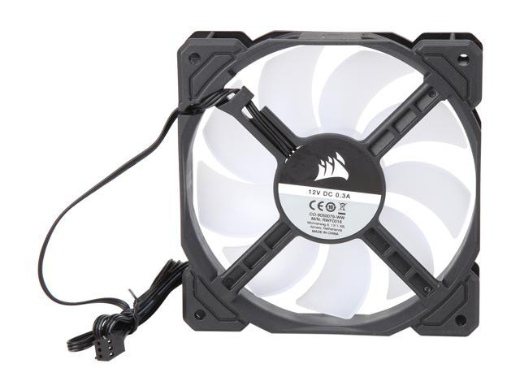
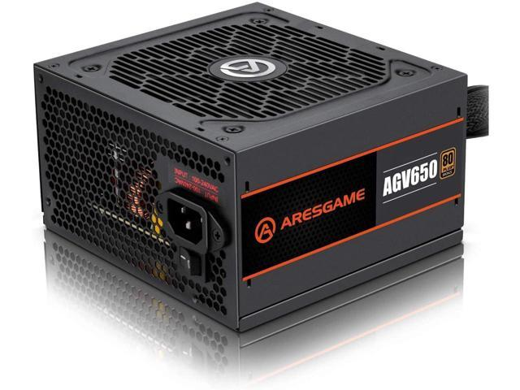

# Hardware

[Return to the How Computers Work mainpage](https://luger-lab.github.io/coding-tutorials/basic_computing_computers/)

## [&larr; Back to Bits](https://luger-lab.github.io/coding-tutorials/basic_computing_computers/bits/)

## Description
Most computers follow general design principles that allow for modular swapping in and out of parts for replacement or upgrading.
0. *Motherboards.* The main hub of a computer is the Motherboard. This is the physical interface where most other components are connected and allowed to communication with each other. This is also the place where the Basic Input/Output System or BIOS is housed. This BIOS is the software underlying basic communication with the hardware of the computer and allows it to boot up. 
0. *CPUs.* The Central Processing Unit or CPU is responsible for carrying out a wide variety of calculations and tasks. CPUs come in a variety of configurations depending on the needs of the system. CPUs are split physically into 'cores' that can be devoted to carry out individual tasks. Some tasks will require multiple cores to carry out tasks efficiently. Cores can also be defined logically by a process called 'hyperthreading' this creates multiple logical cores from a single physical core. This process can allow more tasks to be performed at once, but doesn't always speed up high intensity tasks. A typical laptop might have 8 CPUs hyperthreaded to 16. Performance of CPUs is given in GHz (the number of caluations that can be carried out per second). This number is known as a 'base clock' and can be influenced by a number of things including overall system configuration and cooling properties. 
0. *GPUs.* Graphical Processing Units or 'GPUs' are similar to CPUs in that they carry out calculations quickly. The difference comes in the architecture of a GPU that allows it to perform many more simple calculations at once, versus the fewer, more complex calculations CPUs can carry out. This is why GPUs are used for graphics rendering, because those calculations are relatively simple, but need to be done in massive parallel. This also means that if you can optimize a data processing program to run on a GPU, it is often much faster than the same program running on CPUs. Because the architecture of GPUs and software change so much from version to version comparing the performance of one GPU to another usually requires a functional test on the specific software you want to use. Generally, speeds of GPUs are measured in FLoating point Operations Per Second or 'FLOPS', usually in the TFLOPS range. 
0. *Cooling.* Because the calculations in computers are performed using transistors which act like resistors part of the time, they produce heat. The more calculations performed the more heat is produced. Eventually, these processing units will produce enough heat to start damaging their components. To prevent damage, computers use fans to circulate hot air away from components and bring in cool air. They will also throttle their components to produce less heat when their cooling systems can't keep up. This is why a major limiting factor of computing is actually how much heat can be removed from the computer in a given time. 
0. *Power supplies.* To run all of this hardware, computers use a power supply that converts the voltage from your wall outlet into a lower voltage DC, measured in watts. It is important to have a power supply rated high enough to deliver enough power under peak usage conditions, otherwise your system could run into problems that will cause it to fail and possibly damage itself. 

## [Continue to Storage &rarr;](https://luger-lab.github.io/coding-tutorials/basic_computing_computers/storage/)
