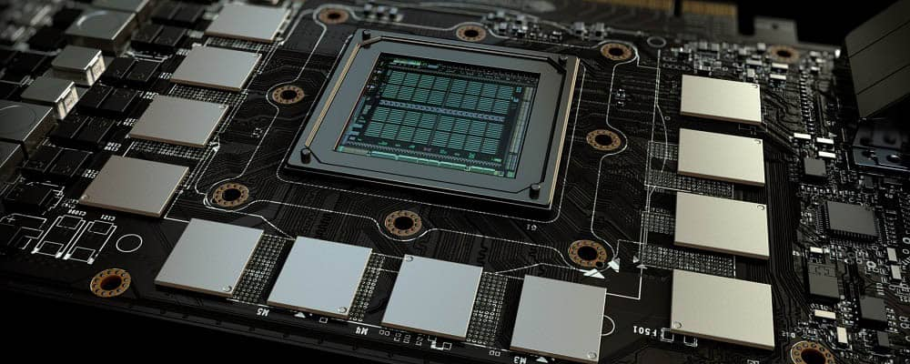
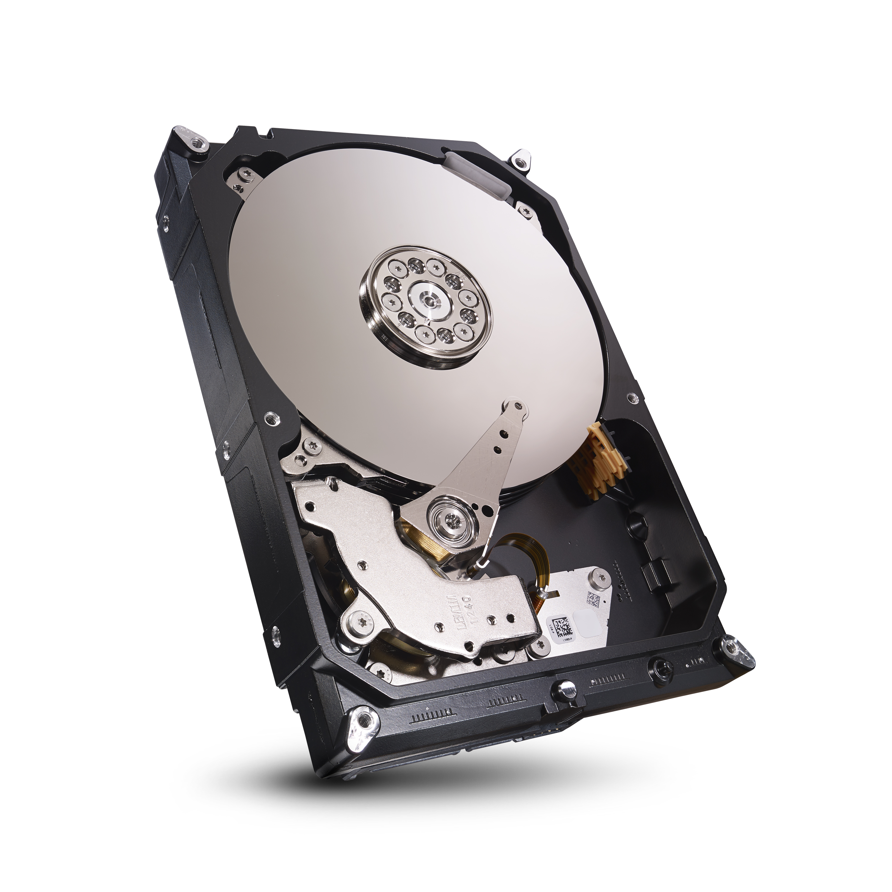
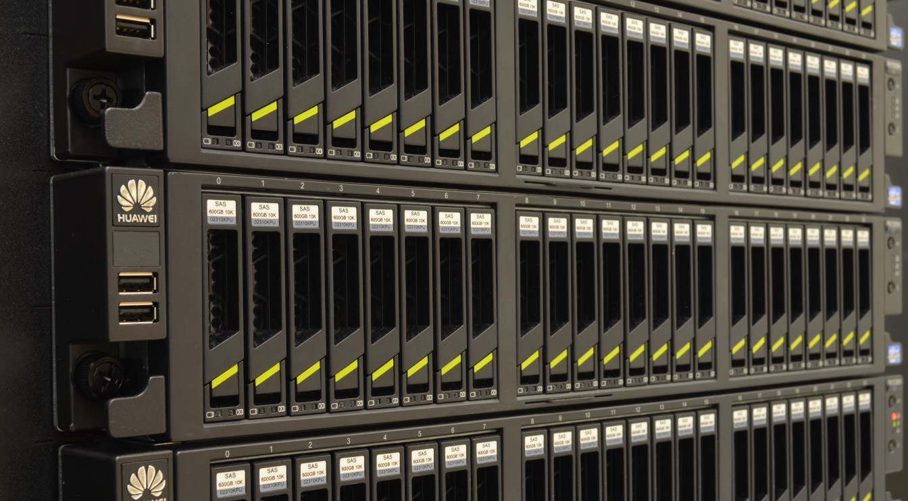

# Storage

[Return to the How Computers Work mainpage](https://luger-lab.github.io/coding-tutorials/basic_computing_computers/)

## [&larr; Back to Hardware](https://luger-lab.github.io/coding-tutorials/basic_computing_computers/hardware/)

## Description
Computers store data by trapping electrons inside capacitors. There are different types of storage devices that are suited to different tasks.

0. *Volatile.* Volatile memory is memory that requires power to maintain stored information. This type of memory is very fast, but often not redundant, degrades quickly when power is interrupted, and expensive. This is why it is used to store information currently being used by tasks and then dumped as it is no longer needed.
    0. *DRAM.* Dynamic Random Access Memory (DRAM) is the type of volatile memory used by CPUs and generally comes in 'sticks' between 16 and 64GBs each. Because any information stored in RAM can be accessed by simply knowing its location, it is super fast and why programs will load content from a longer term storage location into RAM before using it. DRAM can be easily upgraded or expanded by adding new sticks to empty slots on your computer's motherboard and making sure the BIOS recognizes it. 
    0. *VRAM.* Video Random Access Memory (VRAM) is the type of volatile memory used by GPUs. Like DRAM, it is very fast and expensive. Unlike DRAM, this type of memory is built into graphics card and is hard, if not impossible to expand. It also comes in smaller sizes than DRAM, as the maximum amount of memory needed by a graphics card tends to be much less than a CPU. 
0. *Non-Volatile.* Non-volatile memory is memory that can retain its charge for long periods without the need for constant power and are used to store data.
    0. *Hard disk drives.* Hard Disk Drives (HDDs) use rotating magnetic disks to store data. Compared to other types of drives, they are inexpensive and often a good choice for long term data storage. The two major downsides of HDDs are that they have slow read/write speeds and contain moving parts, which are often failure points. 
    0. *Solid state drives.* Solid State Drives (SSDs) use an array of capacitors to store information using flash memory and thus, have no moving parts. The advantages here are that they have fast read/write speeds, tend to fail less frequently, and run silently. They are significantly more expensive than similar sized HDDs, however prices are falling as technology improves and most laptops these days only contain SSDs. 
0. *Redundant Array of Inexpensive Devices.* In order to store lots of data securely, many workstation quality computers and above will employ a logical arrangement of drives known as a Redundant Array of Inexpensive Devices (RAID). These logical arrangements combine multiple drives into a single devices that can spread information between the drives to create redundancy or larger drive space.
    0. *RAID 0.* RAID 0 simply puts multiple drives in series, so as to make a larger storage devices, without redundancy. This type of RAID is generally only employed when the data stored can be lost without consequence.  
    0. *RAID 1.* RAID 1 creates a mirror image of a set of drives on an a second set of drives, which creates redundancy, this allows you to lose any given drive without losing data, and likely even multiple if they don't contain the same data.
    0. *RAID 6.* RAID 6 is a popular option for RAID builds, as it uses parity disk stripping to distribute data in blocks across disks with redundancy. This level of RAID required 4 drives and allows you to lose any 2 of them before data is lost. The disadvantages to this RAID are slow read/write speeds and slow drive rebuild speeds.
    0. *RAID 10.* RAID 10 is the RAID employed in large scale operations like computing clusters and cloud storage systems. It is a combination of RAID 1 and 0, in which you create a larger serial device and then mirror it. This allows for super fast read/write speeds and redundancy. The disadvantages are that it's expensive because your data capacity is only half of the amount your drives can hold and you have be potential to lose data after only 2 drive failures, however in practice you'd have to be really unlucky. And data centers backup their RAIDs frequently anyway.
    **There are more types of RAIDs than these listed, but these are the most common.** 

## [Continue to Clusters &rarr;](https://luger-lab.github.io/coding-tutorials/basic_computing_computers/clusters/)
